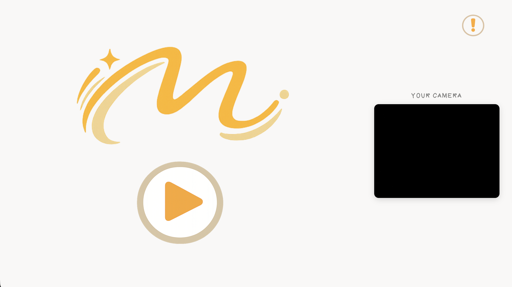
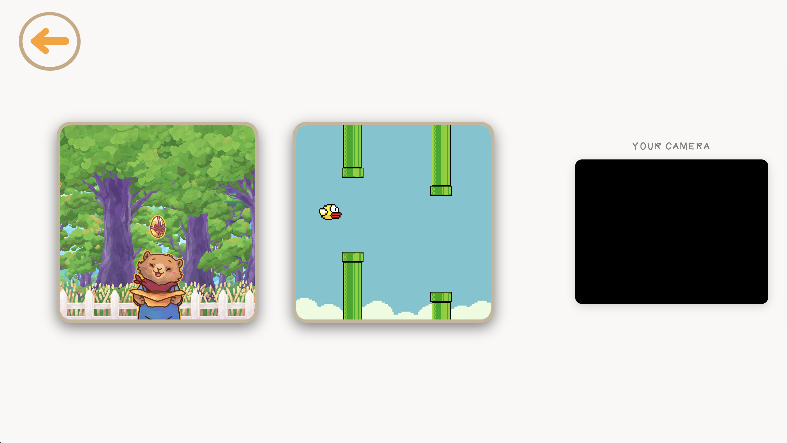
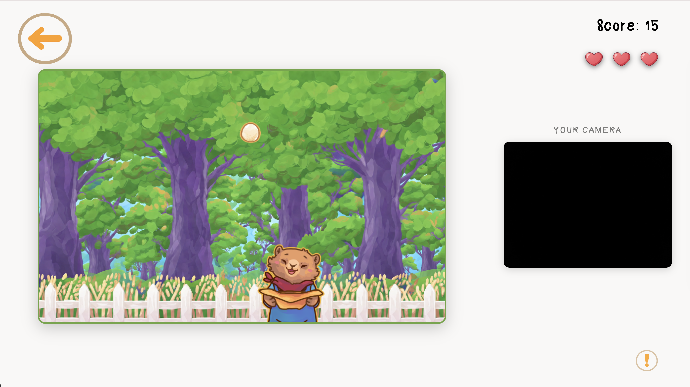
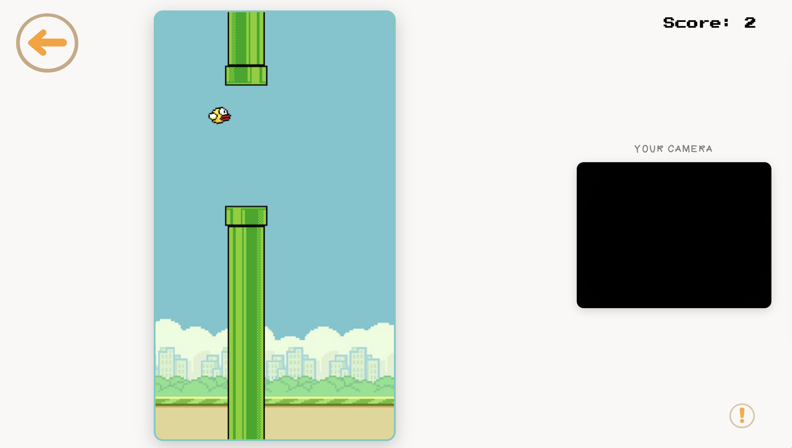

# Motion Strike


Motion Strike is a browser-based motion gaming platform where players control games using real hand movements instead of a keyboard, mouse, or traditional controller. A webcam captures the player's hand movements, and MediaPipe Hands detects gestures and hand positions in real time. The detected gestures are converted into game actions.

**Pipeline:** Webcam captures video, MediaPipe performs hand detection, the gesture recognition system interprets the pose, and the result is translated into an in-game action.

---

## Games

### Catch the Eggs
Catch valuable falling eggs while avoiding dangerous bombs. Move your hand left and right to control the basket. Catch normal eggs for points, golden eggs for bonus points, and avoid bombs or you will lose a life.

### Flappy Bird
Control the bird through obstacles and survive as long as possible. Use an open palm to flap and keep the bird in the air. Avoid the pipes to increase your score.

---

## Getting Started

### Deployed Game
[Play](https://fatema-maitham.github.io/motion-strike/)

### Planning Board
[Planning File](./plan.md)

### How to Play
1. Open the game in your browser
2. Allow webcam access when prompted
3. Use hand gestures to control the games, or use keyboard controls if preferred
4. Press H at any time in a game to open the How to Play panel

---

## Running the Game Locally

This project uses JavaScript ES6 modules (`type="module"`), so opening the HTML files directly (`file://`) will cause browser security (CORS) errors. Run the project using a local development server instead.

### VS Code Live Server (Recommended)

1. Open the project in Visual Studio Code.
2. Install the **Live Server** extension by Ritwick Dey.
3. Right-click `shared/index.html` (or your main entry page) and select **Open with Live Server**.

---

## Win and Loss Conditions

### Catch the Eggs

- Catching a normal egg increases the score.
- Catching a golden egg gives bonus points.
- Catching a bomb removes one life.
- The player starts with three lives.
- The game ends when all lives are lost.
- A `GAME OVER` message and final score are displayed.
- The player can restart using the Thumbs Up gesture, Enter, or Space.

### Flappy Bird

- The score increases when the bird passes through a pipe.
- The bird flaps upward using the Open Palm gesture or Space.
- The game ends when the bird hits a pipe.
- The game also ends when the bird hits the top or bottom of the screen.
- A `GAME OVER` message and final score are displayed.
- The player can restart using the Thumbs Up gesture or Space.

---

## Gesture Controls

### Shared Menu Gestures (All Games)

| Gesture | Action |
|---|---|
| Thumbs Up | Start / Select |
| OK Sign | Confirm / Open How to Play |
| Wave Hand | Return to Menu |
| Peace Sign | Pause / Resume |
| Pinch | Mute / Unmute Audio |

### Catch the Eggs

| Gesture / Movement | Action |
|---|---|
| Move Hand Left | Move Basket Left |
| Move Hand Right | Move Basket Right |

### Flappy Bird

| Gesture | Action |
|---|---|
| Open Palm | Flap / Jump |
| Closed Fist | Reset |

### Game Selection Hub

| Gesture | Action |
|---|---|
| One Finger | Select Catch the Eggs |
| Peace Sign | Select Flappy Bird |
| Wave | Back to Landing |

---

## Keyboard Controls

### Catch the Eggs

| Key | Action |
|---|---|
| Enter / Space | Start / Restart |
| Arrow Left / A | Move Basket Left |
| Arrow Right / D | Move Basket Right |
| P | Pause / Resume |
| M | Mute / Unmute |
| H | Open How to Play |
| Escape | Back to Menu |

### Flappy Bird

| Key | Action |
|---|---|
| Space | Flap / Start / Restart |
| P | Pause / Resume |
| M | Mute / Unmute |
| H | Open How to Play |
| Escape | Back to Menu |

---

## File Structure

```
motion-strike
├── assets/                  # Shared logos, buttons, and game thumbnails
├── catch-the-eggs/          # Catch the Eggs game
│   ├── assets/              # Images, fonts, and sounds
│   ├── css/
│   ├── js/
│   └── index.html
├── flappy-bird/             # Flappy Bird game
│   ├── assets/
│   ├── css/
│   ├── js/
│   └── index.html
├── shared/                  # Shared resources used by both games
│   ├── css/                 # Global styles
│   ├── fonts/
│   ├── js/                  # MediaPipe hand tracking, gesture system, utilities
│   ├── games.html           # Game selection hub
│   └── index.html           # Landing page
├── css/                     # Landing page and hub styles
├── js/                      # Landing page and hub scripts
├── plan.md                  # Project planning document
└── README.md                # Project documentation
```

---

## Technologies Used
- HTML5
- CSS3
- JavaScript (ES6)
- Canvas API
- MediaPipe Hands
- Web Audio API
  
---

## Attributions
 
| Resource | Source |
|---|---|
| MediaPipe Hands | [mediapipe.dev](https://mediapipe.dev) |
| MediaPipe Camera Utils | [cdn.jsdelivr.net](https://cdn.jsdelivr.net/npm/@mediapipe/camera_utils/) |
| Press Start 2P Font | [Google Fonts](https://fonts.google.com/specimen/Press+Start+2P) |
| Pink Lemonade Font | [dafont.com](https://www.dafont.com/pink-lemonade.font?l[]=10&l[]=1) |
| Music | [Pixabay](https://pixabay.com) |
| Art | Baelfin, ChatGPT|
| Sound Effects | [freesound.org](https://freesound.org) |
 
---

## Why Motion Strike

Traditional browser games rely on keyboards and mice. Motion Strike removes that barrier by letting players use their hands naturally. The webcam becomes the controller, making gaming more physical, accessible, and fun.

---

## Next Steps

- [ ] Add more games to the platform, such as Snake, Pong, and Space Invaders
- [ ] Add a high score leaderboard using local storage
- [ ] Add a difficulty selection screen before each game
- [ ] Add an animated onboarding tutorial for first-time players
- [ ] Improve gesture accuracy with custom trained models
- [ ] Add a sound settings panel with a volume slider

---

## Screenshots
 
### Landing Page

 
### Game Hub

 
### Catch the Eggs

 
### Flappy Bird


